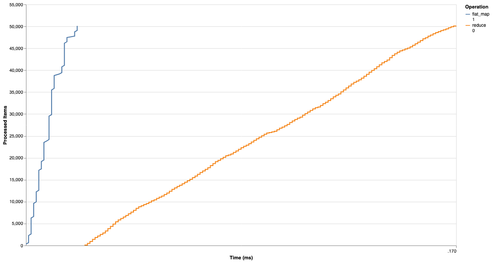

# Flow.Reporter
Reports Flow(s) telemetry events in different formats.

## Sneek Peek
```elixir
alias VegaLite, as: Vl
alias Flow.Reporter
alias Flow.Reporter.Plot
alias Flow.Reporter.Stats

search_space =
  ?a..?z
  |> Enum.into([])
  |> Enum.concat([?\s, ?\s])
  |> IO.chardata_to_string
  |> String.graphemes()

generate_input = fn size ->
  Range.new(0, size)
  |> Enum.map(fn _ -> Enum.random(search_space) end)
  |> IO.chardata_to_string
end

input =
  Range.new(0, 150)
  |> Enum.map(fn _ -> generate_input.(5_000) end)

flow =
  input
  |> Flow.from_enumerable()
  |> Flow.flat_map(&String.split/1)
  |> Flow.partition()
  |> Flow.reduce(fn -> %{} end, fn x, acc ->
    Map.update(acc, x, 1, fn old -> old + 1 end)
  end)

# Here begins the contribution of this work

id = Reporter.uniq_event_prefix()
collector = Stats.new(id)

flow
|> Reporter.attach(collector, id)
|> Flow.run()

spans = Stats.spans_stream(collector)

Vl.new(width: 960, height: 540)
|> Plot.encode_spans(spans)
|> Vl.mark(:line)
|> Vl.Export.save!("roses.html")
```



